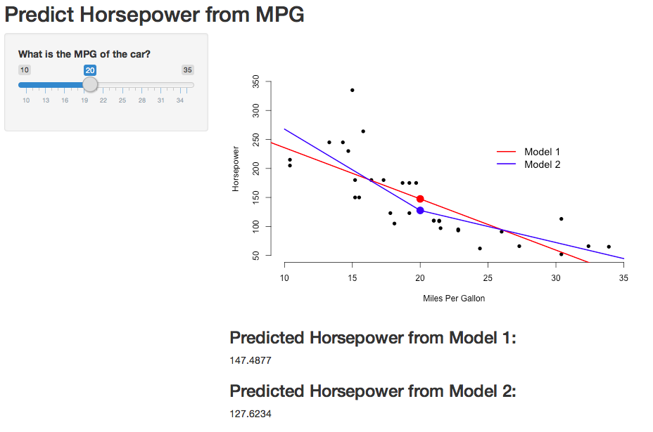

## Reactivity

A reactive expression is like a recipie that manipulates
inputs from Shiny and then returns a value. Reactivity
provides a way for your app to respond since inputs will 
change depending on how users interact with your user 
interface.

## Your First Reactive App

```{r, echo=FALSE}
library(webshot)
appshot("app1", "app1.png")
```

## Prediction App



## Advanced UI

## Interactive Graphics